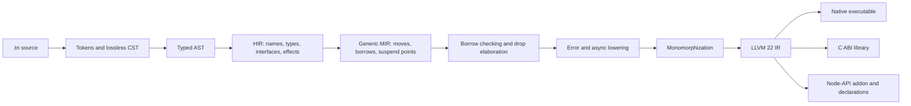

# TypeNative Compiler Architecture

## 1. Purpose and architectural rules

This document defines the implementation boundaries required to realize the
[language specification](language-spec.md). It is normative for compiler,
runtime, standard-library, and tooling architecture but does not override source
semantics.

The architecture follows these rules:

- Parse TypeNative's own grammar; do not route source through a TypeScript AST.
- Share one lossless syntax representation across the compiler, formatter,
  documentation generator, and language server.
- Represent types, ownership, borrows, error effects, and suspension points
  before LLVM lowering.
- Make every cleanup edge explicit in MIR; do not depend on native exception
  unwinding.
- Keep LLVM and platform details behind narrow interfaces that the self-hosted
  compiler can reproduce.
- Keep the runtime small. Ordinary I/O, console output, allocation, scheduling,
  and synchronization are standard-library code, not compiler magic.
- Make compilation deterministic for identical source, configuration, toolchain,
  and environment inputs.

### Current convergence boundary

The ordinary Rust bootstrap is the active implementation used for canonical
source checks. The canonical language surface is recorded in
[`language-spec.md`](language-spec.md), and the migration obligations are
tracked in [`canonical-migration-manifest.md`](canonical-migration-manifest.md).
The Redis validation target is now authored in `validation/redis/*.tn` and
must pass through the same syntax, HIR, type, ownership, MIR, and native
boundaries as every other TypeNative program.

Native functions are explicit ABI boundaries. The reviewed runtime functions
used by allocation, strings, sockets, mutexes, promises, and task groups are
declared in TypeNative standard-library modules and are not hidden compiler
operations. The remaining project-owned C inventory and its retirement
criteria are recorded in [`gate10-native-inventory.md`](gate10-native-inventory.md).
Source-visible compiler hooks and internal operation tags are inventoried in
[`compiler-magic-audit.md`](compiler-magic-audit.md).

The compiler recognizes lowercase `string`, unsized `str`, and borrowed
`&str` as language layout and ownership categories. It does not recognize an
uppercase `String` declaration. Literal-to-owned conversion is type-directed,
retained in typed HIR, and lowered to an explicit MIR operation. String methods
resolve through the canonical standard-library surface; reviewed native calls
remain private implementation details of `std/string`.

`std/string.tn` declares a private `@Intrinsic("string")` nominal definition.
That attribute binds the predeclared owned representation to ordinary declared
members; method names are not selected by the compiler. Static and instance
calls therefore carry normal member identities through HIR and lower as direct
methods in MIR. The binding is accepted only from the bundled string module,
and user declarations cannot claim it. The module graph loads that declaration
as a prelude without importing any private implementation names.

Borrowed slices use a fat reference layout containing a data pointer and
length. Dereferencing `&[T]` operates on that value directly rather than on a
temporary descriptor. `string.bytes()` constructs this view with the private
`slice_from_raw_parts` primitive, ties the source-level borrow to the string
receiver, and exposes no procedural string helper.

This boundary documents compiler-independent preparation only. The protected
`compiler-tn/**` implementation and self-hosting orchestration are not used as
evidence here, and a complete independent compiler chain remains an open
Gate 11 requirement.

## 2. End-to-end pipeline



Each arrow is a validated boundary. A pass must reject malformed input rather
than relying on a later pass or LLVM to detect a compiler invariant violation.

## 3. Planned repository boundaries

Compiler implementation begins with this workspace shape:

```text
crates/
  tn-syntax/          lexer, parser, CST, typed AST, formatter primitives
  tn-diagnostics/     spans, condition identifiers, rendering, fix-its
  tn-hir/             module graph, name resolution, types, interfaces, effects
  tn-typecheck/       inference, conformance, exhaustiveness, effect checking
  tn-mir/             generic MIR, validation, borrow checking, lowering
  tn-codegen-llvm/    LLVM 22 adapter, debug information, object emission
  tn-driver/          queries, configuration, incremental cache, linker driver
  tn-cli/             public tn executable
  tn-node-api/        Node-API wrapper and declaration generation
  tn-test-support/    fixture runner, snapshots, platform harnesses
compiler-tn/          self-hosted compiler source
std/                  TypeNative standard library
tests/                conformance, diagnostics, ABI, integration, and fuzz seeds
toolchains/           checked manifest and setup scripts, never LLVM binaries
```

Crates may depend only downward through this list. Syntax does not depend on HIR;
HIR does not depend on MIR; MIR does not depend on LLVM. The driver composes the
layers without leaking backend types into semantic APIs.

The TypeNative standard library and self-hosted compiler consume the same public
language; they receive no private syntax extensions.

## 4. Syntax infrastructure

### 4.1 Lexer

The Rust bootstrap uses [Logos](https://logos.maciej.codes/) to produce
tokens with byte ranges. Whitespace and comments are retained as trivia so the
tree can reproduce source exactly. The lexer reports invalid UTF-8 before token
creation, distinguishes character, string, and template literal modes, and
maintains nested block-comment depth.

Every token kind and keyword is generated from one declarative table used by:

- the lexer;
- parser token sets;
- syntax highlighting metadata;
- formatter spacing rules; and
- the self-hosted parser's conformance fixtures.

### 4.2 Parser and CST

The parser is recovery-capable recursive descent for declarations and statements
plus Pratt parsing for expressions. It builds a [Rowan](https://docs.rs/rowan/0.16.1/rowan/)
green tree containing every token, trivia item, and explicit error node.

Recovery rules are grammar-specific:

- declarations synchronize at a semicolon, matching closing brace, or next
  declaration starter;
- parameter and argument lists synchronize at a comma or closing parenthesis;
- types synchronize at commas, closing delimiters, `where`, `throws`, or a
  declaration terminator; and
- expressions synchronize without consuming a delimiter owned by their parent.

The parser never invents semantic nodes. Missing tokens exist only as diagnostic
expectations attached to an error node.

### 4.3 Typed AST and formatting

Typed AST wrappers provide checked views over CST nodes. A wrapper returns an
optional child when recovery may have omitted it. HIR lowering is the first pass
that requires a structurally complete declaration.

The formatter prints from the CST and a syntax-kind rule table. Its contract is:

1. formatting succeeds for syntactically recoverable source;
2. comments and literal spelling are preserved;
3. `parse(format(parse(format(source))))` has the same non-trivia tree as the
   first formatted parse; and
4. formatting an already formatted file produces identical bytes.

The language server reparses only changed files and reuses immutable green-tree
subtrees.

## 5. Driver and query model

The driver models compilation as revisioned, memoized queries rather than a
single mutable compiler object. Query keys contain stable file, module,
declaration, and type identifiers; values are immutable and dependency tracked.

Required query groups are:

- source text and line index;
- parse tree and typed AST;
- module import resolution and exported names;
- declaration signatures and generic constraints;
- body HIR and inferred local types;
- interface implementations and coherence;
- error-effect and exhaustiveness analysis;
- generic MIR and borrow-check result;
- reachable monomorphized instances;
- LLVM module fragments and link inputs; and
- documentation and language-server projections.

The on-disk incremental cache includes the compiler build identity, target,
profile, configuration digest, LLVM major, and source-content digests. A mismatch
invalidates the affected cache entries. Cache contents never affect observable
program behavior.

## 6. HIR and semantic analysis

### 6.1 HIR shape

HIR contains no unresolved names or syntax sugar. Every declaration, expression,
pattern, and type refers to an interned semantic identifier. HIR retains source
origins for diagnostics and tooling.

HIR makes these constructs explicit:

- nominal struct, enum, interface, and class identities;
- class base and explicit interface-conformance edges;
- generic type, lifetime, and error-effect parameters with constraints;
- optional types distinct from general enums;
- owning values, shared and mutable references, and raw pointers;
- function safety, async state, and recoverable-error effects;
- contextual object and array literal target types; and
- inserted language operations such as auto-borrow, reborrow, and class upcast.

It does not contain LLVM types, physical offsets, vtable indices, or target
calling-convention details.

### 6.2 Name and module resolution

The resolver builds a complete module graph before checking bodies. Local module
resolution follows the exact file rules from the specification and rejects bare
package names. Imports bind declarations, not copied AST nodes.

Namespaces are separate for types, values, methods, and lifetimes. Duplicate
exported names, ambiguous imports, and inaccessible private members are resolved
before inference.

### 6.3 Type inference and interface coherence

Inference is local and bidirectional. Constraint solving handles equality,
expected-type flow, class subtyping, interface obligations, lifetime outlives
relations, optional narrowing, and numeric literal selection. It does not perform
implicit numeric conversion or search an overload set.

Interface implementations are indexed by the pair `(interface, nominal type)`.
Exactly one implementation may exist in the program. An implementation is legal
only in the module defining the interface or the nominal type, preventing
incoherent foreign implementations.

Dynamic interface coercion is accepted only after explicit conformance is
proven. The HIR records the selected witness-table definition. A user-defined
`for ... of` loop records both its selected `IntoIterator<Item, Iter>`
implementation and the selected `Iterator<Item>` implementation for `Iter`; MIR
never repeats coherence lookup from source spelling.

### 6.4 Error effects and exhaustiveness

Every call expression carries a closed error set. A throwing synchronous call
must be under prefix `try`; a throwing async completion must be under `try
await`. The checker computes the union of reachable effects, subtracts types
handled by catch clauses, and verifies the enclosing declaration.

Match and catch exhaustiveness use a pattern-matrix algorithm over closed enums,
optionals, booleans, and finite integer-enum discriminants. Diagnostics show a
constructible missing pattern rather than only reporting that coverage failed.

## 7. Generic MIR

### 7.1 Representation

MIR is a typed control-flow graph independent of LLVM. A body contains locals,
basic blocks, source scopes, and cleanup scopes.

Core MIR operations include:

```text
Statements:
  Assign(place, rvalue)
  SetDiscriminant(place, variant)
  StorageLive(local)
  StorageDead(local)
  Borrow(destination, kind, place, region)
  Retag(place)
  SetDropFlag(path, initialized)

Terminators:
  Goto(target)
  Switch(value, targets)
  Call(function, arguments, success, error)
  Return(value)
  Throw(error)
  Suspend(value, resume, cancel)
  Drop(place, success)
  Abort(reason)
  Unreachable
```

Places describe a local plus field, dereference, index, downcast, or base-class
projection. Rvalues distinguish copy, move, borrow, checked arithmetic, checked
indexing, aggregate construction, vtable lookup, witness lookup, and raw unsafe
operations.

### 7.2 Validation

Every MIR transformation runs a validator. It checks type agreement, complete
terminators, valid unwind-free error edges, initialized operands, legal
projections, dominance of definitions, drop-flag ownership, and suspension
metadata.

MIR text has a deterministic debug form used in snapshots. Snapshot syntax is
not a public language interface.

## 8. Ownership and borrow checking

Borrow checking runs on generic MIR before monomorphization. It receives
interface facts such as `Copy`, `Drop`, `Send`, and `Sync` as constraints rather
than inspecting concrete LLVM layouts.

The analysis consists of:

1. definite initialization and move-path construction;
2. liveness and non-lexical region inference;
3. loan creation for shared and mutable borrows;
4. conflict detection over overlapping places;
5. reference-outlives validation;
6. suspension validation for borrows live across `await`;
7. partial-move and destructor legality; and
8. thread/task capture checks for `Send`, `Sync`, and process lifetime.

Unsafe blocks do not skip this analysis. Raw-pointer operations appear as unsafe
MIR operations, but surrounding safe references and owned values remain checked.

Diagnostics retain the origin, last use, conflicting access, and inferred end of
each loan. A borrow diagnostic must explain the source-level ownership event; it
must not expose only region variable numbers.

## 9. Drop and error lowering

After borrow checking, drop elaboration assigns flags to every conditional or
partially moved ownership path. It inserts destruction blocks for:

- normal scope exit;
- `return`, `break`, and `continue`;
- each recoverable call error edge;
- constructor failure;
- match-arm exit; and
- future completion or cancellation.

Typed throws are then lowered to an internal tagged return value. Calls branch
to explicit success and error blocks. Catch dispatch switches on the error tag;
propagation moves the payload to the caller after cleanup. No LLVM landing pads,
personality functions, or native unwinding tables implement recoverable errors.

`panic` lowers to a runtime diagnostic followed by LLVM `abort`/`unreachable`.
No cleanup edge is generated for panic.

## 10. Async lowering and execution

Generic MIR contains `Suspend` terminators before state-machine transformation,
allowing the borrow checker to reason about values live across suspension.

Async lowering creates:

- a state enum;
- fields for every local live across a suspension point;
- per-field initialization/drop flags;
- a pinned `poll` method;
- a cancellation/drop method covering every state; and
- success and typed-error completion variants.

The generated promise is cold and move-only until polling begins. Polling pins
its storage. Cancellation transitions exactly once to a terminal state and drops
initialized fields in reverse construction order.

The compiler defines the `Future` protocol and state-machine transformation. The
executor, reactor, timers, task groups, queues, and platform polling are
`std/async` code. There is no process-global executor created by the compiler.

Detached tasks require process-lifetime owned captures. Structured task groups
may borrow from their lexical owner because the group cannot exit before all
children complete or cancel.

## 11. Monomorphization and reachability

Monomorphization starts from executable entry points, exported C/Node-API
symbols, test registrations, and referenced statics. It substitutes concrete
type, interface-witness, and lifetime-erased layout arguments into validated
generic MIR.

Instances are keyed by declaration plus canonical type and error-effect
arguments. Recursive instance discovery uses a work queue and an in-progress
marker to support recursive functions without infinite compiler recursion.

Lifetimes do not appear in generated code. They must already have been proven by
borrow checking. Error-effect parameters are substituted with their concrete
tagged sets. Interface-constrained generic calls become direct calls to the
selected implementation.

## 12. Class and interface lowering

### 12.1 Object layout

A class allocation contains a runtime header followed by base and derived
fields. The header points to an immutable type descriptor. Default layout is
private and target-specific.

A descriptor contains:

- a stable identity within the linked program;
- its base descriptor or no base;
- object size and alignment;
- a virtual destruction entry;
- the class vtable; and
- references to witness tables for explicitly implemented interfaces.

It contains no source field names, arbitrary method names, or constructors.

### 12.2 Calls and casts

Virtual calls load a fixed slot established when the class hierarchy is
validated. `override` checking guarantees slot type compatibility. Final and
proven monomorphic calls may bypass the vtable.

Upcasts adjust the data pointer if the target representation requires it and
preserve or consume ownership according to the source expression. `instanceof`
walks or accelerates the immutable base-descriptor chain. A checked downcast
returns an optional adjusted pointer for a borrow or branches to a derived owner
and preserved source owner for an owning conversion.

Dynamic interface values are a data pointer plus witness pointer. Owning dynamic
values additionally retain the correct destruction operation.

## 13. LLVM backend

### 13.1 Toolchain contract

The compiler pins [LLVM 22.1.8](https://llvm.org/).
`toolchains/manifest.json` records the LLVM major, accepted patch, host artifacts
or installation recipes, archive checksums, and the compatible Rust binding
feature. Setup verifies the installation and `LLVMGetVersion`, rejects any
version other than the manifest's exact release, and records the result. The
backend independently rejects a different LLVM major before code generation.

The Rust bootstrap pins
[Inkwell 0.10.0](https://docs.rs/inkwell/0.10.0/inkwell/) with
its `llvm22-1` feature. All Inkwell values stay inside `tn-codegen-llvm`;
upstream layers use TypeNative types and MIR identifiers only.

The self-hosted backend binds `llvm-c` directly and performs the same major
check. The design does not assume the LLVM C API is semantically compatible
across LLVM majors.

### 13.2 Type and operation lowering

Code generation establishes a target machine and data layout before lowering
types. It lowers:

- fixed integers to same-width LLVM integers;
- `isize`, `usize`, and `number` to target pointer width;
- `f32` and `f64` to LLVM float and double;
- structs and tuples to target-layout aggregates;
- enums and optionals to selected tag/payload or niche layouts;
- references and raw pointers to LLVM pointers with different semantic metadata;
- class owners to non-null object pointers;
- interface values to data/witness pairs; and
- functions to explicit success/error return conventions.

Checked integer operations use LLVM overflow intrinsics and branch to panic on
the overflow bit. Indexing checks precede address calculation. Codegen must not
attach `nsw`, `nuw`, `inbounds`, non-null, aliasing, or dereferenceable metadata
unless MIR facts prove the relevant invariant.

### 13.3 Verification and emission

Each generated function and module is verified through LLVM before optimization.
Verification failure is a compiler defect with serialized MIR and minimized LLVM
IR attached to the diagnostic artifact.

Supported products are object, LLVM IR, bitcode, assembly, executable, shared
library, and Node-API addon. Optimized builds use the pinned LLVM optimization
pipeline; debug builds preserve source structure and emit DWARF. Both preserve
the same checks and failure behavior.

## 14. Runtime and standard library boundary

Compiler-provided runtime symbols are limited to:

- process startup and entry dispatch;
- allocator ABI hooks and allocation-failure termination;
- panic formatting and abort;
- class allocation/deallocation and descriptor primitives;
- reference-count control blocks used by the standard library;
- test registration sections; and
- platform-independent hooks needed by generated Node-API wrappers.

Collections, strings, bytes, files, networking, threads, locks, futures,
executors, console output, and formatting are implemented in TypeNative. Their
unsafe cores call libc, pthreads, kqueue, or other macOS target facilities
through reviewed FFI modules.

`std/console` is a synchronous, best-effort convenience layer over the standard
stream machinery. It discards destination write failures without panicking or
recording hidden state. The `std/io` standard-stream writers retain the
fallible path and report `IOError` when output delivery is part of program
correctness.

Every safe standard-library API has an internal invariant statement and tests
that exercise its unsafe implementation under sanitizers.

## 15. C and Node-API generation

### 15.1 C ABI

The semantic checker validates exported C signatures before MIR. The backend
uses LLVM's target calling convention and exact `@repr("C")` layouts. It emits a
C header from the same resolved signature model used for code generation.

No wrapper silently converts a string, slice, class, optional, or typed error.
Higher-level C interfaces must be authored explicitly as status codes, raw
pointer/length pairs, and ownership functions.

### 15.2 Node-API

The Node-API generator consumes resolved exported declarations and creates:

- wrapper MIR for argument validation and conversion;
- native ownership/finalizer records;
- synchronous error-to-JavaScript exception conversion;
- promise/deferred bridging for async exports;
- one module initialization entry; and
- a `.d.ts` file from the exact same type mapping.

Generated native code calls only the
[Node-API C surface](https://nodejs.org/api/n-api.html). It does not call V8,
libuv, or Node.js C++ internals. Borrowed inputs end before wrapper return;
borrowed outputs fail semantic validation.

## 16. Diagnostics

Diagnostics are structured records containing:

- a machine-readable condition identifier;
- severity;
- primary and secondary labeled spans;
- causal notes;
- zero or more applicability-ranked edits; and
- a documentation key.

Condition identifiers are organized by subsystem but message prose is not a
compatibility boundary. Golden tests assert identifiers, spans, labels, and
edits separately from terminal color and incidental wording.

Every pass reports through `tn-diagnostics`; no pass prints directly. The CLI,
language server, JSON output, and test harness render the same record.

## 17. Determinism and self-hosting

Compilation order is stable: modules, declarations, generic instances, symbols,
metadata, and link inputs are sorted by semantic identity rather than hash-map
iteration. Build timestamps, absolute workspace paths, random seeds, and host
environment values are excluded unless explicitly declared inputs.

Self-hosting proceeds by behavior and fixed-point validation:

1. the Rust bootstrap builds compiler A from `compiler-tn`;
2. compiler A builds compiler B from the same source and inputs;
3. compiler B builds compiler C identically;
4. B and C outputs must match under the deterministic build profile; and
5. both compilers run the complete conformance and integration suites.

Artifact equality is a fixed-point check, not proof of compiler correctness. The
conformance suite, MIR validation, LLVM verification, sanitizer runs, C/Node-API
tests, and integrated Redis program remain independent requirements.

The Rust bootstrap is retained as a reproducible seed and tested against the
same source suite. After the fixed-point and full-suite checks pass, the
self-hosted compiler is the implementation built, distributed, and used for
normal development; the Rust bootstrap remains only the reproducible seed. It
is not the normative definition of the language.
